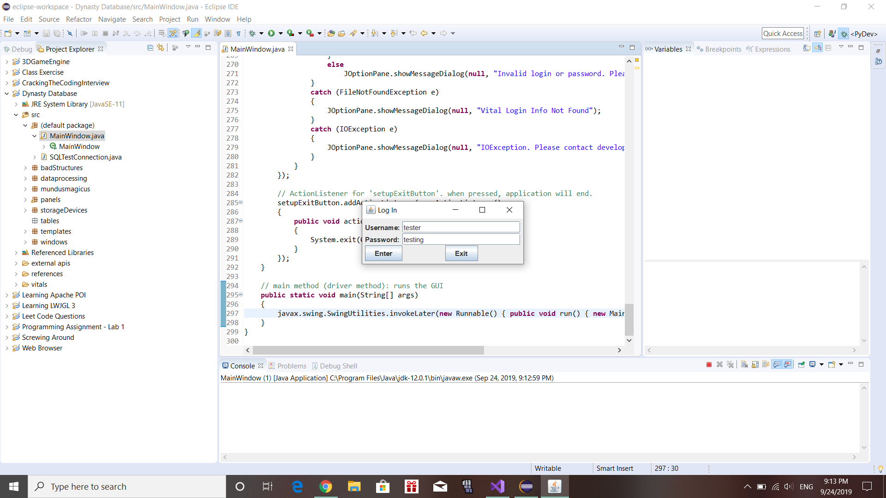
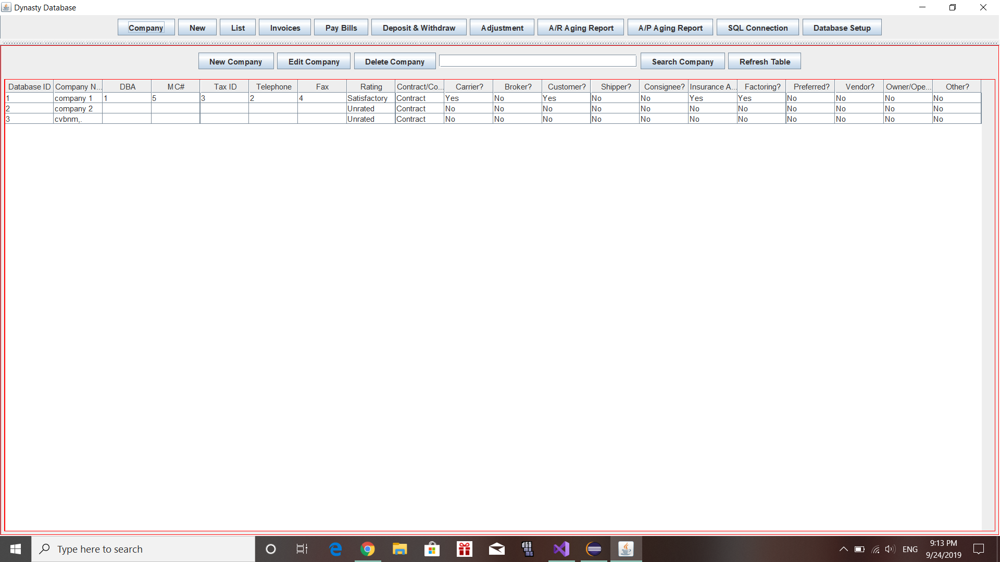
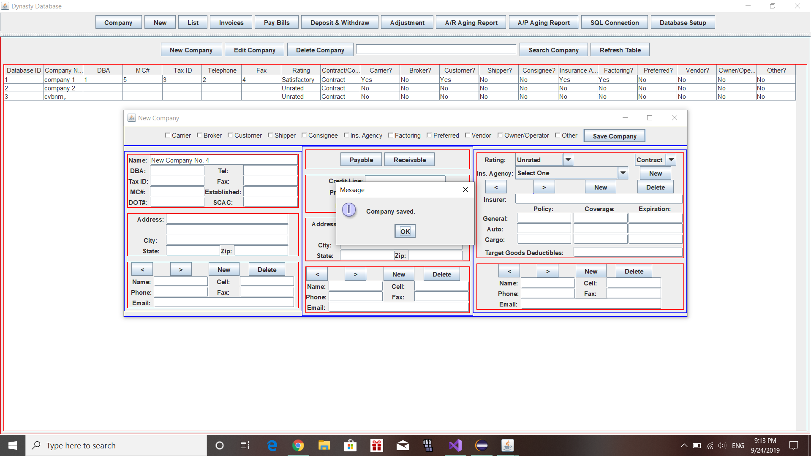
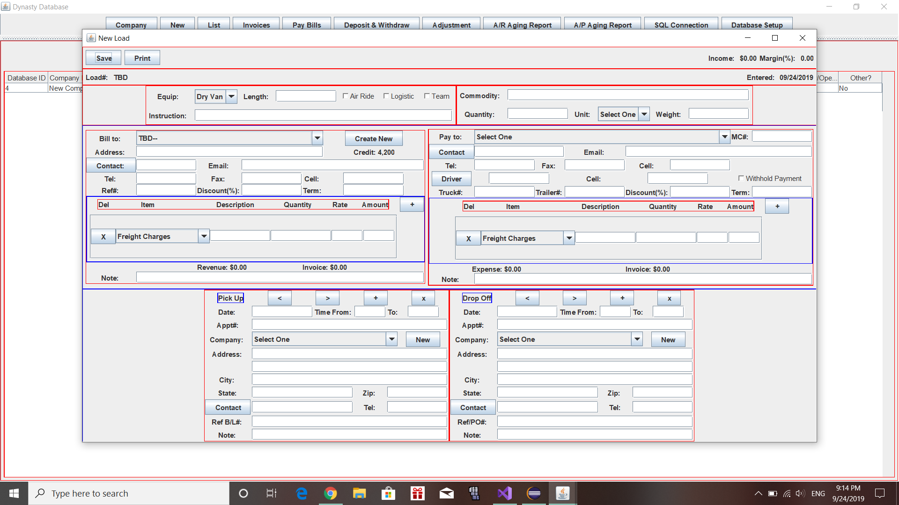
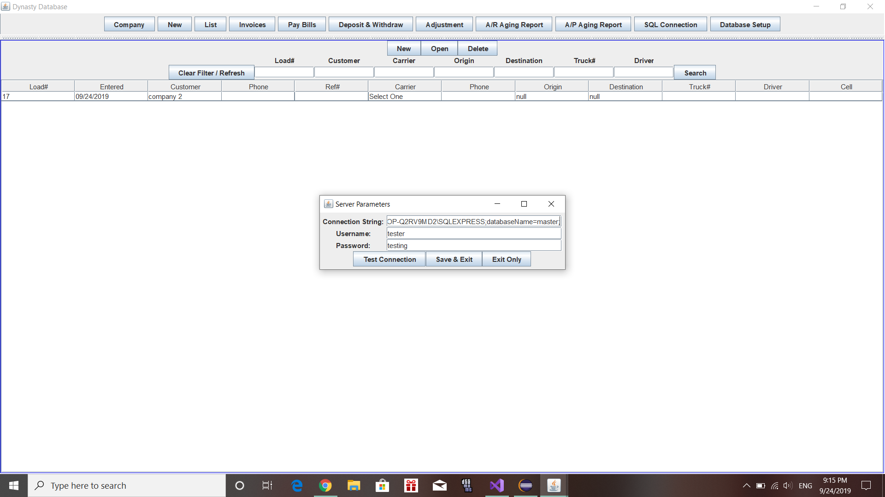
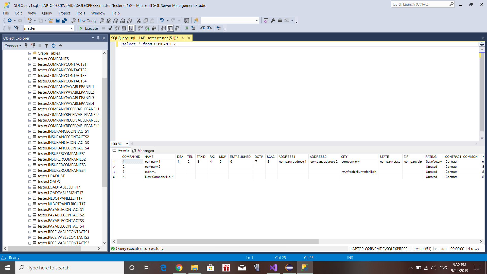

# Trucking-Database
[WORK IN PROGRESS] A GUI application designed for dispatchers who work in the trucking industry. Will include functions for adding companies, creating/editing loads, creating/printing invoices, printing checks, and accounting. Data will be queried to and from an SQL database; some data will be kept in text files, and read through I/O streams. GUI components are built using Java Swing, and SQL is done using JDBC. Document editing is currently planned to be done by Apache POI, but that may change in the future.

Screenshots:

